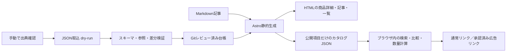
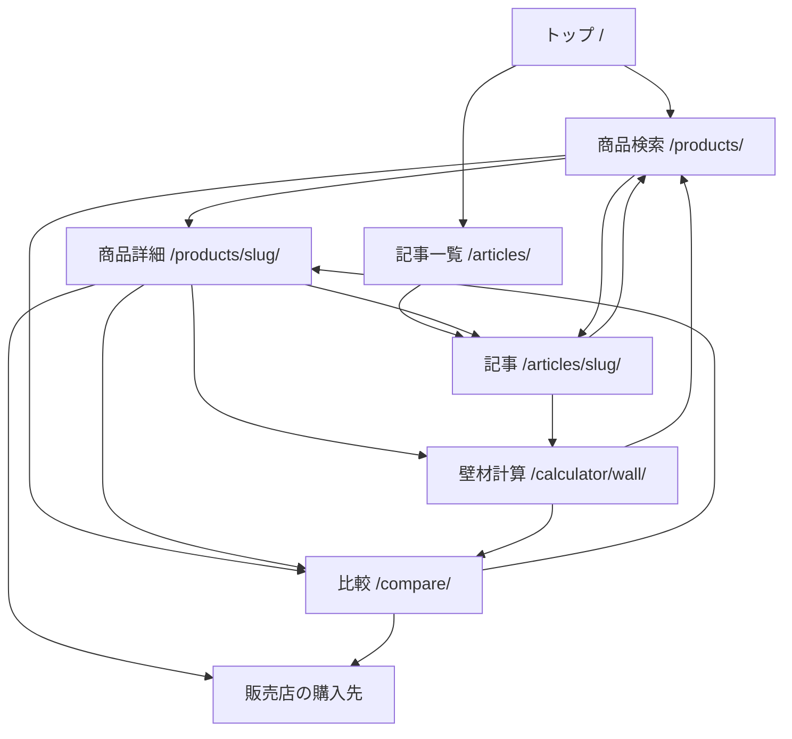

# wood-stack 要件・詳細設計

作成: 2026-09-22。状態: CEOレビュー待ち。プロダクトコード未実装。

上位企画は[PLANコピー](../../PLAN-20260922-301-wood-stack.md)、正本情報は[資料索引](../../README.md)。本書と[実装計画](../plans/2026-09-22-wood-stack.md)をまとめてレビューする依頼に基づく提案であり、実装承認は未取得。

## 1. 利用者・範囲・成功条件

個人DIYと小規模店舗オーナーが板材・天板の仕様と購入条件を複数店舗で比較できることを初版の目的とする。壁の寸法を入力すれば、計算可能な板材について必要枚数・購入セット数・材料費の概算が分かる。記事から条件付き検索へ移動し、分からない用語は検索結果から記事で確認できる。

木材・内装資材を起点とし、関連するレントラックス案件があるカテゴリーへの拡張を許容する。カテゴリー内の商品掲載は案件の有無を問わない。広告関係は検索順位・比較候補・関連記事の選定に使わず、案件外の商品にも通常の購入先リンクを付ける。

初版の対象は検索、最大3件比較、詳細、壁材計算、記事、手動確認＋JSONファイル取込。会員、サイト内決済、3D、画像認識、全店舗自動収集、在庫同期、CMS管理画面は対象外とする。初版の計算は長方形一面、開口部差引きなし、端材再利用なしを推奨する。CEOへの範囲確認事項は[レビュー案内](../../review.md)に残す。

数量は材料購入の概算。構造・耐荷重・防火・施工適合を判定しない。接着剤、下地、工具、塗装、施工費、決済方法ごとの手数料は計算対象に含めず、結果に対象外費用を表示する。

## 2. 技術構成と責務

[技術選定案](../../decisions/2026-09-22-static-catalog.md)に従い、Astro静的生成＋TypeScript＋JSON＋Markdownを採る。[Life Optimizer調査](../../research/2026-09-22-lifeoptimizer-reuse.md)で確認した検索状態・比較・記事リンクの責務分離を利用する。

- Node.js 22系（22.12.0以上）、npm、package-lock.jsonを使用する。
- Astro 7系、TypeScript strict、Vitest、Playwrightを候補とし、実装時に互換性を確認してlockfileへ固定する。
- 公開販売条件500件、記事100件、公開カタログJSON非圧縮1MiBを初版の上限とする。
- 寸法はmm整数、金額はJPY整数。実測小数は最小値を切り捨て、最大値を切り上げた包含範囲として登録する。
- 本番公開・デプロイ・マージは別途明示承認を必要とする。



`src/catalog/` は型、登録検証、公開投影を担当。`src/search/` はURL状態と絞り込み、`src/calculator/` は数量の純粋計算、`src/offers/` は価格・送料・リンク判定を扱う。Astroページはこれらの戻り値を表示し、計算式をテンプレートに重複させない。

広告の報酬率・契約メモ・認証値は公開リポジトリにもブラウザにも保存しない。公開可能なリンク種別と表示文だけを台帳へ置く。サーバーAPIは初版に設けない。

## 3. 画面遷移と操作



| 画面 | 入力・主要表示 | 状態・導線 |
|---|---|---|
| トップ | 「板材を探す」「天板を探す」「壁材の数量を計算」、新着記事3件 | 商品の広告枠や報酬順のおすすめは置かない |
| 商品検索 | カテゴリー、検索語、材種、仕上げ、用途、寸法範囲、購入単位予算、並び順 | 1商品1カード。条件に合う寸法・販売条件をカード内で選択。詳細、比較、用語の記事へ |
| 商品詳細 | 寸法バリエーション、販売店別の販売条件、確認日、出典、画像、関連記事 | バリエーション未指定時は購入数量計算を無効化。販売条件を選んで計算・比較へ |
| 壁材計算 | 壁幅・高さ・方向・継ぎ・加工余裕・予備材、対象の販売条件 | 計算結果、計算式の内訳、条件外の理由、材料費。比較トレイから最大3件を再計算 |
| 比較 | 最大3列、各列は商品＋寸法＋販売店＋セットの組 | 0件は検索へ、1件は単独表示し追加を案内。異なるカテゴリーは同時比較しない |
| 記事一覧・詳細 | タイトル・説明文の語句検索、カテゴリ、更新日、出典 | 記事の条件付き検索リンクと対象商品の詳細リンク。商品から同じ記事へ戻れる |
| 掲載方針 /policy/ | 広告関係、順位、価格確認、計算の範囲、更新・訂正方法 | 全画面のフッターから参照 |

一覧カードは商品名、店舗数、選択中の寸法・販売単位・価格・送料状態・確認日を表示する。同じ商品の寸法違いを店舗数へ加算しない。選択中の販売条件が変わっても、既に比較へ追加した列は書き換えず、別途追加操作を必要とする。同一組の重複追加は無視する。

比較4件目は選択を変えず「比較は3件まで。1件外して追加してください」と通知する。カテゴリー違いも現在の選択を保持して拒否し、「板材と天板は分けて比較してください」と表示。削除後の空欄は詰め、列順は追加順とする。

検索結果0件では条件を維持し、件数0、各条件の解除ボタン、全解除を表示。広告商品への差し替えや自動条件緩和はしない。詳細の未知slugは404、非公開商品は生成しない。販売終了の公開済み詳細は残し、購入CTAを「販売終了」に置換する。

JS無効時も静的一覧・商品詳細・記事・通常購入先は読める。検索・比較・計算の操作部は無効状態と説明を出す。JSON読込失敗時は再試行を案内し、静的一覧を残す。誤入力中に前回の計算値を現行結果として表示しない。

## 4. 検索条件とURL状態

| 条件 | 規則 |
|---|---|
| カテゴリー | `board` / `top`。初期値board。切替時は寸法・用途・予算を解除し、検索語・材種・仕上げを保持 |
| 検索語 | 最大100文字。NFKC、小文字化、空白分割。商品名・材種・仕上げ・販売店名へAND部分一致。HTMLとして解釈しない |
| 材種・仕上げ・用途 | 初版は各1選択。未確認値は指定条件に適合しない。用途は販売元が明示したタグだけを使う |
| 寸法 | 長さ・幅・厚さ各min/max。1〜10000mm整数、min≤max。空欄は条件なし。確認済みの寸法範囲が指定範囲内に全て収まるものを適合とする |
| 価格予算 | 0〜1000000円整数。検索では「1販売単位の税込上限」と明示。税込固定価格が分かるものだけ適用 |
| 状態 | 初期は販売中・受注生産・要見積もり・在庫未確認。販売終了・展示のみ・売切れは除外。比較URLで指定済みなら列に状態を表示して保持 |
| 並び順 | 既定は名前順。他に確認日が新しい順、同カテゴリの参考単価順。広告情報は全ての順序で不使用 |

板材の参考単価は税込セット価格÷セットの使用可能最小面積、天板は税込の1枚価格（セット販売なら税込価格÷入数）を使う。入数不明のセットは単価不明とする。板材で面積・税込価格が不明、天板で見積もり・変動価格なら単価順の末尾に「比較単価不明」として配置する。板材の円/㎡は小数を保持して比較し、表示は1円単位に四捨五入。セット最安値を必要量の最安値と呼ばない。

順序の同点規則は指定指標→正規化商品名のコードポイント順→productId→variantId→offerIdの昇順。名前順は数値指標を使わない。更新順は該当販売条件の価格・仕様確認日の古い方を代表日として降順。nullは末尾。広告の有無もリンク種別もタイブレークへ入れない。初期の材種語彙は杉・桧・パイン・その他、仕上げは無塗装・研磨・塗装・エイジング、用途はwall・shelf・desk・counterとする。複数仕上げを持つ商品は主仕上げを1件登録し、追加の仕上げはdescriptionへ記載。未確認値はnullで保持する。

検索はvariant/offerに条件を適用した後にproduct単位にまとめる。カードの代表offerは選択中の並び順で先頭の適合offer。店舗数は適合offerのsellerIdを重複排除した数。先頭の代表が変わることをカードに明記し、詳細で全販売条件を確認できる。

URLのqueryは `v=1,category,q,species,finish,use,lmin,lmax,wmin,wmax,tmin,tmax,budget,sort,page,compare` とする。比較はofferIdをカンマ区切りで最大3件。壁計算は `ww,wh,direction,joint,trim,kerf,reserve,extra,mbudget` を追加する。`mbudget` は材料費予算（0〜1000000円、空欄は制限なし）であり、検索の販売単位予算budgetと別に保持する。計算画面から検索へ戻すときも相互変換しない。全画面で同じパーサーを使い、記事リンクも同じエンコーダーで生成する。

未知キーは無視、未知enumは初期値、重複キーは最初の値。不正な数値・範囲・未知vはその条件を適用せず、何を無視したか通知する。URL全体は2048文字まで。比較IDは存在・公開状態を検証して重複排除し、先頭3件を採る。削除済みIDは通知して除く。入力を勝手に上限へ丸めない。正規化後のURLをreplaceStateで置換する。

検索・計算の「適用」でpushState、ページ移動でpushState、戻る／進むで復元。フォーム入力中はURLを変えない。比較操作はreplaceStateで全ページへのリンクに引き継ぐ。localStorageは初版では使わない。記事からの初回条件はURLがある場合にURLを優先し、暗黙に上書きしない。

一覧は24商品/ページ。条件変更はpage=1へ戻す。ページ範囲外は最終ページへ正規化、0件時はpage=1。記事一覧は12件/ページ、更新日降順→slug順とする。

## 5. データ構造

台帳は `schemaVersion:1` と以下の配列を持つJSON。IDは小文字英数字とハイフンによる安定ID、表示名やURLの変更では変更しない。`null` は未確認、空文字や0を未確認の代用にしない。

| エンティティ | 必須項目と関係 |
|---|---|
| Seller | id, name, channel（direct/marketplace）, shopUrl, purchaseHosts（購入先host許可リスト） |
| Product | id, slug, name, category（board/top）, species, finish, uses[], description（自作文）, status（draft/published）, identityEvidenceId, imageId/null |
| Variant | id, productId, sellerSku/null, length, width, thickness, coverageWidth, geometry（uniform/mixed/irregular）, evidenceId |
| Offer | id, variantId, sellerId, sourceUrl, purchaseUrl, saleUnit（piece/set）, piecesPerUnit/null, price, shipping, availability, minimumUnits, unitStep, maxUnits/null, checkedAt, evidenceIds[] |
| AdLink | offerId, state（none/pending/approved/suspended）, url/null, allowedHosts[], checkedAt/null, expiresAt/null |
| Evidence | id, url, checkedAt（YYYY-MM-DD）, method（direct/search-index/kcp-record）, fields[], note（短い自作文） |
| ImageRight | id, localPath/null, sourceUrl, state（unknown/permitted/owned/expired）, basis, checkedAt/null, expiresAt/null, attribution/null |
| Article | Markdown frontmatter: title, description, slug, category, publishedAt, updatedAt, status, productIds[], searchPreset/null, evidenceUrls[] |

Sellerは購入先チャネル単位。同一事業者の直販とモールは別Sellerにし、店舗数の表記は「購入先数」とする。同一商品と断定できるメーカー品番またはメーカー根拠がある場合だけProductを共通化する。見た目や名前の類似だけでBASEとCreemaの商品を同一Variantに統合しない。

寸法の型は次の判別集合。長さの注文可能範囲と納品寸法のばらつきを別に扱う。

```ts
type Dimension =
  | { kind: 'bounded'; minMm: number; maxMm: number }
  | { kind: 'nominal'; mm: number; note: string }
  | { kind: 'selectable'; minMm: number; maxMm: number; stepMm: number }
  | { kind: 'unknown' };
type Price =
  | { kind: 'fixed'; yen: number; tax: 'included' | 'excluded' | 'unknown' }
  | { kind: 'from'; yen: number; tax: 'included' | 'excluded' | 'unknown' }
  | { kind: 'quote' }
  | { kind: 'unknown' };
type Shipping =
  | { kind: 'free'; regions: string[]; maxUnits: number | null; evidenceId: string }
  | { kind: 'fixed'; yen: number; regions: string[]; maxUnits: number; evidenceId: string }
  | { kind: 'unknown'; note: string }
  | { kind: 'quote'; note: string };
type Availability = 'available' | 'made-to-order' | 'quote' | 'unknown'
  | 'sold-out' | 'discontinued' | 'display-only';
```

`coverageWidth` は実際に覆える幅。無加工の平板は確認済みの板幅を転記できる。実加工の重なり部分が不明な場合はunknownとし、見かけ幅から推定しない。1セット内に幅が違う板を含むmixed、曲線・耳付きのirregular、注文寸法未指定のselectableは初版の幾何計算対象外。

注文寸法を選択した場合はその寸法に対応する価格と納品公差を確認して別Variant/Offerとして登録する。指定可能範囲だけから寸法固定のofferを自動生成しない。piecesPerUnitは1以上の整数、piece売りは1。minimumUnitsとunitStepは1以上、maxUnitsがあるときはminimumUnits以上。

既知の仕様・価格・送料には該当fieldsの出典を必須とする。unknownは出典不足を許容し、その理由をnoteへ残す。

価格は販売単位あたり。税抜や税区分不明は原文の区分を添えて表示する。税率や端数処理を推測して税込額へ変換せず、費用順位と予算判定から除く。送料は価格と別の出典を持てる。offer.checkedAtは販売状態の確認日、仕様はvariant.evidenceIdの確認日、価格はoffer.evidenceIdsでfieldsにpriceを含む出典の確認日を使う。同じoffer内で同じfields項目に複数の現行出典を登録した場合は取込エラーとし、旧出典はGit履歴に残す。追加加工を選ぶと価格が変わる商品はその条件を確認したofferのみ固定価格にする。

公開前に、ID・slugの重複、参照切れ、URLのHTTPSとhost、実在する日付、未来日、数値の有限性・整数・範囲を検証する。published商品には名前、カテゴリ、出典、最低1件のofferが必要。仕様不明でもunknownを明示すれば掲載できる。根拠なしの用途タグや許可不明の画像は公開しない。

## 6. 壁用板材の数量計算

### 6.1 入力と対象条件

壁幅ww・壁高whは100〜10000mmの整数。方向はvertical/horizontal、初期vertical。長手継ぎはnone/butt（突付け概算）、初期none。突付けは支持位置・目地の施工指示を意味せず、利用者が継ぐ前提を選んだことだけを表す。

加工余裕trimは各端0〜20mm、初期5。切断余裕kerfは0〜10mm、初期3。予備率reserveは0〜30%整数、初期10。追加予備extraは0〜100枚整数、初期0。単位と初期仮定を結果直上に常時表示する。初版では目地の隙間と窓・ドアの面積を差し引かない。

通常の概算にはuniform、length/coverageWidthがbounded、piecesPerUnit既知を必要とする。幅・長さにnominalが含まれる場合は参考計算を別枠とし、購入数量・費用順位には入れない。selectable/unknown/mixed/irregular、天板は計算対象外とする。販売終了等のofferは新規計算候補から除外し、共有URLに残ったときは旧条件の参考値と状態を表示する。

### 6.2 算式

張る方向に沿った距離をS、それと直交する距離をCとする。縦張りはS=wh, C=ww、横張りはS=ww, C=wh。板1枚から使う長さの上限は `E = L - 2*trim - kerf`。両端の加工と切断をまとめた保守的な減算であり、全ての板に適用する。E≤0なら計算不可。

```text
列数 R = ceil(C / B)                       BはcoverageWidth
列あたり板数 J = ceil(S / E)               butt時
joint=none かつ S>E → 長さ不足で計算不可
joint=none かつ S<=E → J=1
施工分 N = R * J
予備枚数 P = ceil(N * reserve / 100) + extra
必要枚数 Q = N + P
必要販売単位 U0 = ceil(Q / piecesPerUnit)
購入販売単位 U = minimumUnits + ceil(max(0,U0-minimumUnits)/unitStep)*unitStep
購入枚数 K = U * piecesPerUnit
セット都合の余り = K - Q
予備を含む未使用見込み = K - N
材料費 M = U * 税込固定価格
```

板の切れ端は別の列へ再利用せず、最後の列の幅切り端も捨てる前提。面積の余りは端材と予備板を含むため、再利用可能な端材量と呼ばない。加工減算と予備率を別項目で表示し、同じロス率を二重に掛けない。

Lmax/Bmaxで得る値を最少側、Lmin/Bminで得る値を最多側として2回評価する。両側が成立すれば必要枚数・販売単位・材料費を範囲で表示し、購入目安には最多側を使う。範囲の値が同じでも寸法ばらつきの注記は残す。noneで最少側だけ成立する場合は「一部の寸法では長さ不足」として購入目安を出さない。

列ごとに均等な長さS/Jの部材をJ本使う概算とする。これにより最後に極端に短い継ぎ材が生じることを避ける。ただし図面や下地の継ぎ位置を計算しないため、施工可能とは判定しない。幅切り・継ぎ・固定方法は販売店や施工者に確認する。

上限は購入100000枚・10000販売単位・100000000円。超過またはmaxUnits超過なら理由を返し、部分的な数値を購入目安として表示しない。計算前に入力を検証し、NaN・無限大・負数・指数表記・小数・桁区切りを拒否する。UIの入力は全角数字だけ半角化し、前後空白を除去して整数文字列で検証する。

### 6.3 送料と価格表示

材料費は板材代だけ。「送料等を含む確認済み小計」は税込材料費と送料が両方確定した場合だけ表示し、施工総額とは呼ばない。送料がunknown/quoteなら小計もnull。freeは0円として足し、unknownを0円へ変換しない。

初版には配送先フォームを置かない。全国・離島例外なし・選択数量で適用できることを出典で確認した送料だけを確定扱いとする。地域指定・数量依存・最低注文額依存の条件が未解決なら送料確認が必要と表示する。同店舗の複数商品を合算したカート送料は計算しない。

壁材結果の「材料費が安い順」は通常概算が成立し、販売状態がavailable/made-to-orderで、税込材料費が確定するofferについて最多側Mの昇順→offerId昇順とする。残るofferは理由別の別枠に置き、参考計算値と並べて順位を付けない。送料は材料費順位に含まれないことを見出しへ明記。予算は最多側M≤予算だけを適合とし、範囲が予算をまたぐ場合は「予算を超える可能性」に分類する。

## 7. 出典・登録・更新・画像・広告

初回登録は担当者が公式商品ページを読み、商品識別、選択肢、販売単位、価格、送料、販売状態、画像権利を確認する。取込形式はUTF-8のJSONのみとし、トップレベルはschemaVersionと各エンティティ配列。CSV変換は初版の範囲外。ファイル取込は10MiBまで、完全検証後に差分を出すdry-runを既定とする。

同じIDの登録は明示的な更新。削除はstatus変更で表し、取込ファイルから欠けた行を自動削除しない。重複ID、未知キー、参照切れ、型違反は1件でも全件反映を止める。`--apply --expected-sha <dry-runで表示した現在台帳ハッシュ>` の一致時だけ一時ファイルへ書き、renameで台帳を置換する。rename前の失敗では既存台帳を保持する。rename完了後は再読して保存済みのSHAを確認し、ログ出力だけが失敗した場合は再反映せず結果確認から復旧する。ネットワーク取得や広告申請は取込処理から実行しない。

更新担当は運営者。価格・送料・販売状態を週1回、仕様・リンク・画像権利を月1回確認し、確認できた項目だけcheckedAtを更新する。30日超の価格・送料・販売状態は古い情報として価格順位と予算判定から除外。90日超の仕様は再確認が必要な参考計算に降格する。日付差はJSTの暦日で計算し、nowを関数へ注入してテストする。閲覧時にも鮮度を評価し、古い静的ビルドで日付表示だけ新しく見せない。

404や販売終了を確認した場合は該当状態へ変更する。一時的な429・通信失敗では値や確認日を更新せず、失敗履歴を運営用記録へ残す。検索インデックスやKCPの旧確認値を直接確認へ昇格しない。`Evidence.method` で取得経路を表示し、direct以外の価格は参考表示に限定する。

画像はpermitted/ownedかつ期限内だけを配信し、指定のクレジットを表示する。unknown/expiredは中立の「画像未掲載」枠に置換。出典URLだけで転載許可があるとみなさず、外部画像のhotlinkも行わない。商品説明は事実を短く自作文でまとめる。

広告リンクはAdLinkがapproved、期限内、購入対象offerが一致、hostが許可リスト内の場合だけ採用する。pending/suspended/none/期限切れ/壊れたリンクなら通常purchaseUrlへ戻す。広告リンクは「広告・販売店で確認」とし `rel="sponsored noopener"`。通常リンクは「販売店で確認」とし `rel="noopener"`。同一タブを既定とする。

順位計算へ渡す型にAdLinkを含めない。UI表示直前にofferIdで結合する。広告の有無で商品を除外・優先せず、広告リンクを停止しても通常購入先が残る。未確認の提携条件や報酬算定は公開前に確認し、報酬予測に利用しない。

## 8. 記事・アクセシビリティ・品質

記事の初期テーマは「必要枚数とセットの違い」「寸法のばらつき」「価格と送料の見方」の3件。実装時に自作文で作り、材料費計算の対象外費用や販売店の説明へのリンクを付ける。関連記事はproductIds一致→category一致→updatedAt降順→slug順で最大3件。広告有無を入力に含めない。

検索プリセットの未知値、非公開商品への記事参照、公開記事の出典URL不備はビルドを止める。商品詳細・記事は静的HTML、タイトル・description・canonicalを持つ。検索query付きページと比較・計算はnoindex。公開ホスト決定までは本番canonical・sitemapを確定せず、公開作業の検証で設定する。

フォームにはlabelと単位、エラーには対象欄へのリンクを付ける。件数・比較追加はaria-live=politeで通知し、色だけで状態を示さない。比較表にはcaption、行・列見出しを設け、モバイルでは表だけを横スクロール可能にする。375px幅と1280px幅、キーボード操作、200%拡大で主要操作を確認する。

受入用500 offerのデータで検索と3件再計算を各100回測定し、p95が200ms以内を目標とする。計測環境とデータ件数を記録し、超過時は原因を調べる。ブラウザへ契約情報・非公開商品・画像権利メモを出さず、JSON埋込みの `<` はエスケープする。

## 9. 受入条件

| ID | 条件と検証方法 | 実装Task |
|---|---|---|
| A01 | variantとofferを分離。同じproductの寸法違いで購入先数が増えない。参照切れは取込失敗 | 1,4 |
| A02 | 範囲外・未知値・不正URL、未来確認日を拒否。unknownと0を区別するスキーマテスト | 1 |
| A03 | 列×継ぎ、方向変更、予備率のceil、セット・最低数量・注文刻みのceilを固定値で検証 | 2 |
| A04 | 寸法範囲の両端、noneの片側成立、unknown/mixed/selectableで購入目安を出さない | 2 |
| A05 | 送料unknown→小計null、free→0円加算。税区分不明・見積もりを費用順位へ入れない | 3 |
| A06 | 広告レコードを追加・削除・入替しても全並び順のofferId配列が同じ。関連記事も同じ | 3,4,7 |
| A07 | AND検索、範囲全体適合、同点順、0件、24件ページ、URL round-tripと戻る操作 | 4,6 |
| A08 | 最大3件、重複、異カテゴリ拒否、売切れ・削除された比較ID、空比較を検証 | 4,6 |
| A09 | 記事→条件付き検索→商品→記事、詳細→計算→比較→通常購入先のE2E | 6,7 |
| A10 | 無効画像・広告期限切れで画像を出さず通常リンクへ戻す。鮮度30/31日・90/91日の境界 | 3,5 |
| A11 | 取込dry-run無変更、不正1行で全件失敗、SHA不一致、適用失敗で既存台帳を保持 | 1 |
| A12 | 実商品比較例を固定fixture化し、原典の未確認情報を勝手に補わない | 2,3,8 |
| A13 | JS無効・読込失敗、375px、キーボード、拡大、外部リンク属性を確認 | 5,6,8 |
| A14 | 公開上限・非公開情報漏出・記事参照・生成リンク・ビルドをCIで検証 | 7,8 |

実商品による3条件の例と計算可能／要確認の分類は[比較資料](../../research/2026-09-22-real-products.md)を参照する。広告中立性と0円送料の試験には合成データも使い、実商品の確認事実と混同しない。

## 10. レビュー後の進め方

CEOが本書と実装計画をレビューし、修正または承認を記録する。承認後に実装Task 1から着手する。公開前の広告条件・画像許可・ドメイン・配信先は[レビュー案内](../../review.md)で別の判断として管理する。今回の成果物をもって上位PLAN全体をimplementedにしない。
